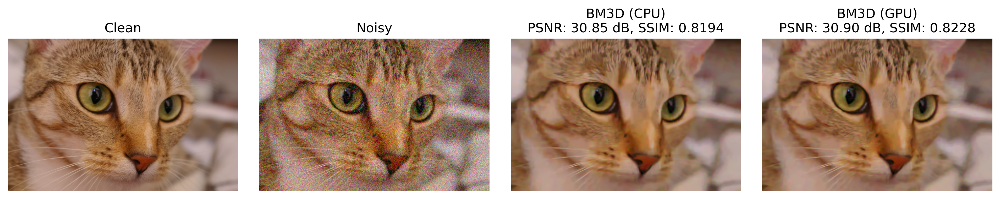

BM3D with CuPy
==============

This repository contains a GPU-accelerated implementation of BM3D using CuPy. The main script is `bm3d_cupy.py`, which provides a function `bm3d_gpu` that can be used to denoise 2D images `(H, W)` or `(H, W, C)` on the GPU. The `bm3d_cupy_benchmark.py` script benchmarks the performance of the GPU implementation against the CPU version.

This implementation is intended to be as close as possible to the reference CPU implementation in the official BM3D implementation, which can be found [here](https://pypi.org/project/bm3d/). The transforms used in this implementation are directly taken from the official implementation, and most parameters are set to the default values used in the official implementation. 

Different transforms than the default can also be used. However, you would need to change the code yourself:

```python
# 2d transforms (along spatial dimensions)
spatial_ht, spatial_ht_inv = _transform_matrices(p, 'bior1.5')  # biorthogonal WT, (p, p)
spatial_wiener, spatial_wiener_inv = _transform_matrices(p, 'dct')  # DCT, (p, p)
# 1d transforms (along group dimension)
group_ht, group_ht_inv = _transform_matrices(ht_group_size, 'haar')  # Haar, (k_ht, k_ht)
group_wiener, group_wiener_inv = _transform_matrices(wiener_group_size, 'haar')  # Haar, (k_w, k_w)
```

The purpose of this implementation is to provide a fast and GPU-accelerated version of BM3D, which is beneficial for **fast prototyping** and, in particular, for **integration as a plug-and-play prior** into an iterative image reconstruction algorithm that is already implemented on the GPU (e.g., SigPy). 


Requirement
-----------

```bash
pip install cupy bm4d
```


Usage
-----

```python
import cupy as cp
import numpy as np
from skimage.data import cat

from bm3d_cupy import bm3d_gpu


rng = np.random.default_rng(seed=0)


x = cat().astype('float32') / 255.0
sigma = 0.1
y = (x + rng.standard_normal(x.shape).astype('float32') * sigma).astype('float32')

y_gpu = cp.asarray(y)
sigma_gpu = cp.asarray(sigma, dtype=cp.float32)
z_gpu = bm3d_gpu(y_gpu, sigma_gpu)
z = cp.asnumpy(z_gpu)
```


Result
------

On an NVIDIA RTX 6000 Ada, the GPU implementation achieves a speedup of 15.91x compared to the reference CPU implementation for the following cat image.



```
BM3D (CPU) time: 3.0155 (0.0226) s
  PSNR: 30.85 dB
  SSIM: 0.8194


BM3D (GPU) time: 0.1881 (0.0004) s
  Speedup: 16.03x
  PSNR: 30.90 dB
  SSIM: 0.8228
```

The argument `chunk_size` determines the number of groups to be processed in parallel on the GPU. A larger `chunk_size` increases GPU memory usage but can improve speed. However, in practice, extremely large `chunk_size` leads to poor speed, possibly due to overhead. The default value of `chunk_size=2048` is set according to the experiment shown above run on the RTX 6000 Ada GPU. You may need to adjust it for different GPUs and images.
